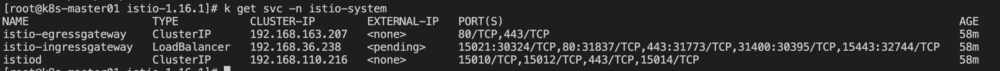
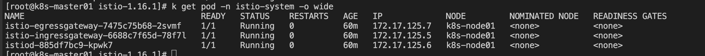

#### Istio 安装

1、安装 istio   

1) 下载 istio 版本
```shell
// 安装最新版本
curl -L https://istio.io/downloadIstio | sh -
// 指定版本安装
curl -L https://istio.io/downloadIstio | ISTIO_VERSION=1.16.1 TARGET_ARCH=x86_64 sh - 
```
```shell
Downloading istio-1.16.1 from https://github.com/istio/istio/releases/download/1.16.1/istio-1.16.1-linux-amd64.tar.gz ...
Istio 1.16.1 Download Complete!
Istio has been successfully downloaded into the istio-1.16.1 folder on your system.
```

2) 将 istioctl 加入 $PATH 中
```shell
# 当前下载解压的路径
cd /home/kubernetes/istio-1.16.1
# 这里可以简单拷贝到对应的 PATH 路径中，也可以自己指定
cp bin/istioctl /usr/bin
```

3) 使用 demo 配置进行安装
```shell
# demo 配置组合
istioctl install --set profile=demo -y
# 给命名空间添加标签，指示 Istio 在部署应用的时候，自动注入 Envoy 边车代理
kubectl label namespace default istio-injection=enabled
```
- service 部署情况
```shell
kubectl get svc -n istio-sytem
```


- pod 部署情况
```shell
kubectl get pods -n istio-system -o wide
```



