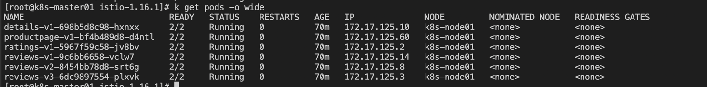
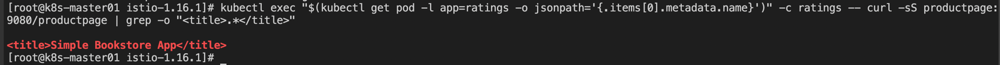

#### Bookinfo 实例

1、部署 bookinfo 实例
```shell
kubectl apply -f samples/bookinfo/platform/kube/bookinfo.yaml
```

2、查看资源部署情况
- services
```shell
kubectl get svc
```

- pods 
```shell
kubectl get pods -o wide
```


3、确认 Bookinfo 是否在运行
```shell
kubectl exec "$(kubectl get pod -l app=ratings -o jsonpath='{.items[0].metadata.name}')" -c ratings -- curl -sS productpage:9080/productpage | grep -o "<title>.*</title>"
```


4、确定 Ingress 的 IP 地址和端口
```shell
kubectl apply -f samples/bookinfo/networking/bookinfo-gateway.yaml
```

1) 查看 gateway 资源
```shell
kubectl get gateway
```


2) 设置访问网关的 INGRESS_HOST 和 INGRESS_PORT 变量
- INGRESS_HOST
```shell
# 判断当前环境是否支持外部的负载均衡器
kubectl -n istio-system get service istio-ingressgateway -o jsonpath='{.status.loadBalancer.ingress[0].ip}'
```
如果 istio-ingressgateway 的 EXTERNAL-IP 为 Pending 状态，则不支持 LB   
如果没有外部负载均衡器，返回值为空，那就选择一个节点端口来代替   

- INGRESS_PORT
```shell
# 默认 80
kubectl -n istio-system get service istio-ingressgateway -o jsonpath='{.spec.ports[?(@.name=="http2")].port}'
```

- SECURE_INGRESS_PORT
```shell
# 默认 443
kubectl -n istio-system get service istio-ingressgateway -o jsonpath='{.spec.ports[?(@.name=="https")].port}'
```

不支持则设置入站的端口：
```shell
export INGRESS_PORT=$(kubectl -n istio-system get service istio-ingressgateway -o jsonpath='{.spec.ports[?(@.name=="http2")].nodePort}')
export SECURE_INGRESS_PORT=$(kubectl -n istio-system get service istio-ingressgateway -o jsonpath='{.spec.ports[?(@.name=="https")].nodePort}')
```

5、设置对外访问 URL
1) 设置环境变量 GATEWAY_URL
```shell
export GATEWAY_URL=$INGRESS_HOST:$INGRESS_PORT
```

2) 确保 IP 地址和端口均成功地赋值给了环境变量
```shell
echo $GATEWAY_URL
```


