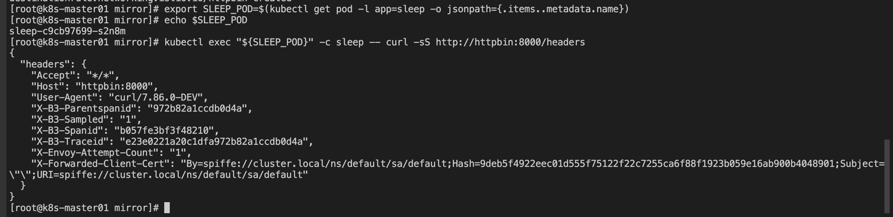
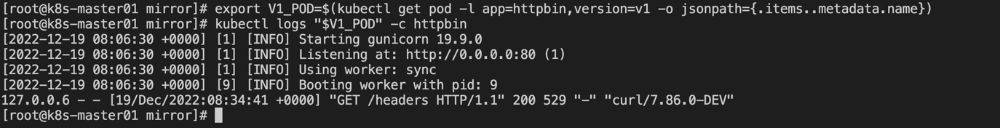
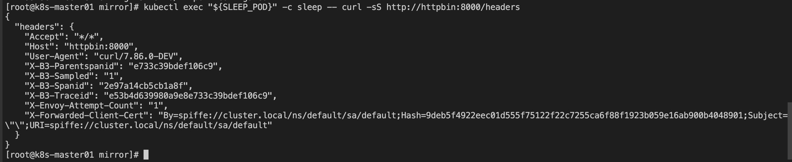
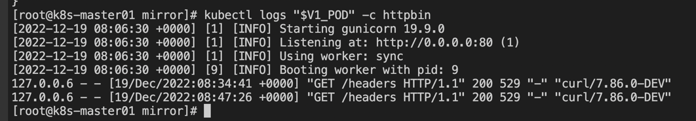
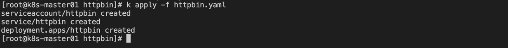
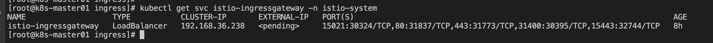
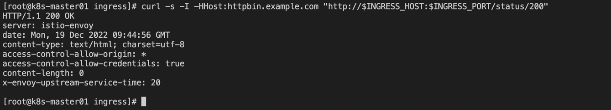
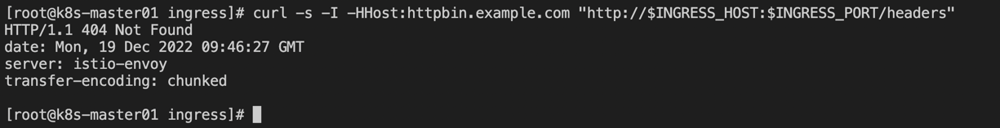
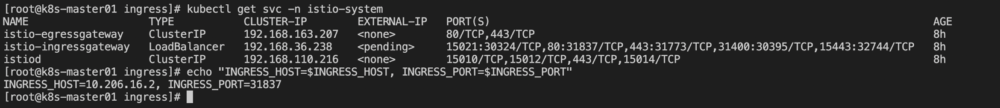
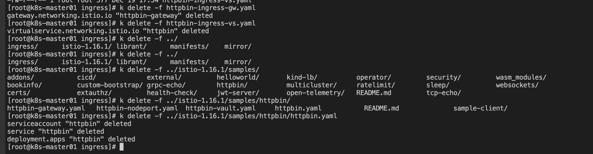

### Traffic Management

#### **1、流量控制 CRD** 
- VirtualService
  - 控制流量转发规则及 API 粒度治理功能，包括错误注入，域控制等
- DestinationRule
  - 抽象路由转发的上游目标服务及其相关配置项
- ServiceEntry
  - 将服务网格之外的 IP 流量注册到 Istio 中
- Gateway
  - 一般用于 Ingress 和 Egress, 定义服务网格的初入口及相关治理规则
- Sidecar
  - 用于声明服务网格中服务间的依赖关系

1) VirtualService
- 在 VirtualService 中定义了一组路由规则, 当流量进入的时，则逐个规则进行匹配，直到匹配成功后将流量转发给指定的路由地址

关键字段解析：
- hosts: 用来配置下游访问的可寻址地址
- match: 用来配置路由规则（uri/method/authority/headers/port/queryParam）
- route: 用来配置路由转发目标规则，可以指定需要访问的 subset(服务子集)

2) DestinationRule
- 定义网格中某个 service 对外提供的服务策略及规则，包括负载均衡策略、异常点检测、熔断控制、访问连接池等

负载均衡策略：
- 简单的负载均衡策略
  - ROUNDROBIN：轮询
  - LEASTCONN: 最小链接数
  - RANDOM：随机
  - PASSTHROUGH
- 一致性 Hash 策略
- 区域性负载均衡策略

3) Gateway 
- 定义了所有 HTTP/TCP 流量进入网格的统一入口和从网格中出站的统一出口

4) ServiceEntry
- 将网格外的服务注册到 Istio 的注册表中，可以把外部服务当做和网格内部的服务一样进行管理和操作

global.outbandTrafficPolicy.mode:
- ALLOW_ANY: Istio 代理允许调用未知服务
- REGISTRY_ONLY: Istio 代理会阻止任何没有在网格中定义的 HTTP 服务或 ServiceEntry 的主机

5) Sidecar
- 在默认情况下，Istio 中所有 Pod 的 Envoy 代理都是可以被寻址的


#### **2、路由**   
路由规则可以让用户很容易地控制服务之间的流量和 API 调用

1) VirtualService
- 由一组路由规则组成，用于对服务实体（kubernetes 中对应为 pod）进行寻址
- 描述了用户可寻址目标到网格内实际工作负载的映射
- 通过对客户端请求的目标地址与真实响应请求的目标工作负载进行解耦来实现
- 可以为1个或者多个主机指定流量行为

2) 路由规则
路由规则一般定义在 VirtualService 的 hosts 字段和 http 字段中
- hosts: 描述该路由规则生效的目标服务
- http: 描述流量匹配条件和路由目标地址

**匹配条件：**
- match 字段进行限定（bookinfo-router-vs.yaml）

**Destination：**
- destination 字段可以指定符合条件的流量目标地址

**路由规则的优先级：**
- 从上到下的顺序进行选择
- route 字段中定于的 destination 顺序

**路由规则的更多内容：**
- 将特定的流量子集路由到特定目标地址的工具
- 在 VirtualService 中，流量端口，header 字段和 URI 等内容上都是可以设置匹配条件

3) DestinationRule   
- DestinationRule 是在 VirtualService 路由规则之后起作用
- 允许在调用完整的目标服务或特定的服务子集
  - Random: 将请求转发到一个随机的实例上
  - Weighted: 按照指定的百分比将请求转发到实例上
  - Least Requests: 将请求转发到具有最少请求数目的实例上

4) Gateway   
- 管理进出网格的流量，可以指定进入或离开网络的流量
- 为 Gateway 指定路由，需要通过 VirtualService 的 Gateway 字段，将 Gateway 绑定到一个 VirtualService 上

5) ServiceEntry    
- 支持对接 kubernetes, consul 等多种不同的注册中心
- 将外部的服务条目添加到 Istio 内部的服务注册表中，以便让网格中的服务能够访问并路由到这些手动指定的服务

**使用 ServiceEntry 访问外部服务：**    
- 允许 Sidecar 将请求传递到未在网格内配置过的任何外部服务
- 配置 ServiceEntry 以提供对外部服务的受控访问
- 允许特定范围内的 IP 地址，完全绕过 Sidecar

**Sidecar 对外部服务的处理方式：**    
- ALLOW_ANY：默认值，表示 Istio 代理允许调用未知的外部服务
- REGISTRY_ONLY：Istio 代理会阻止任何没有在网格中定义的 HTTP 服务或 ServiceEntry 主机

查看当前使用的模式：
```shell
kubectl get cm istio -n istio-system -o yaml | grep -o "mode:"
```

**使用 ServiceEntry 管理外部流量：**   
- 结合 VirtualService 为对应的 ServiceEntry 配置外部服务访问规则，如请求超时，故障注入等，实现对指定服务的受控访问
- fault 字段进行配置


#### **3、流量镜像**
影子流量，通过配置将线上的真实流量复制一份到镜像服务中，并通过流量镜像转发，从而达到在不影响线上服务的情况下对流量或请求内容做具体分析的目的

1) 流量镜像的配置
- 通过 VirtualService 中 http 配置项
  - mirror: 用于配置一个 Destination 类型的对象，即镜像流量转发的服务地址
  - mirrorPercentage: 用于配置一个数值，用来指定有多少的原始流量会被转发到镜像流量服务中

2) 流量镜像实践

**部署测试服务：**

- 部署两个版本的 httpbin 服务
```shell
kubectl apply -f httpbin-mirror-deploy-v1.yaml
kubectl apply -f httpbin-mirror-deploy-v2.yaml
```


- 部署一个 httpbin 的 service 
```shell
kubectl apply -f httpbin-mirrir-svc.yaml
```


- 创建一个默认的路由策略
```shell
kubectl apply -f httpbin-mirror-vs-v1.yaml
kubectl apply -f httpbin-mirror-dr.yaml
```


- 向服务发送一部分流量
```shell
# 获取 sleep pod 的 name
export SLEEP_POD=$(kubectl get pod -l app=sleep -o jsonpath={.items..metadata.name})
# 登录 pod, 执行 curl 命令
kubectl exec "${SLEEP_POD}" -c sleep -- curl -sS http://httpbin:8000/headers
```


- 分别查看 v1 和 v2 版本的日志
```shell
export V1_POD=$(kubectl get pod -l app=httpbin,version=v1 -o jsonpath={.items..metadata.name})
kubectl logs "$V1_POD" -c httpbin
```


```shell
export V2_POD=$(kubectl get pod -l app=httpbin,version=v2 -o jsonpath={.items..metadata.name})
kubectl logs "$V2_POD" -c httpbin
```


此时 v2 版本没有收到对应的请求信息

- 镜像流量到 v2
```shell
kubectl apply -f httpbin-mirror-vs-v2.yaml
```

- 发送流量
```shell
kubectl exec "${SLEEP_POD}" -c sleep -- curl -sS http://httpbin:8000/headers
```


- 分别查看 v1 和 v2 版本的日志
```shell
kubectl logs "$V1_POD" -c httpbin
```


```shell
kubectl logs "$V2_POD" -c httpbin
```


3) 清理
- 删除规则
```shell
kubectl delete -f httpbin-mirror-vs-v2.yaml
kubectl delete -f httpbin-mirror-dr.yaml
```
- 关闭 Httpbin 服务和客户端
```shell
kubectl delete -f httpbin-mirror-svc.yaml
kubectl delete -f httpbin-mirror-deploy-v2.yaml
kubectl delete -f httpbin-mirror-deploy-v1.yaml
kubectl delete -f httpbin-sleep-curl-deploy.yaml
```


#### **4、Ingress/Egress**
- 微服务集群的出入口流量需要单独管理

1) ingress

**启动 httpbin 服务**
```shell
kubectl apply -f samples/httpbin/httpbin.yaml
```


**确定 Ingress IP 和端口**
```shell
kubectl apply -f httpbin-ingress-gw.yaml
```

确认集群是否运行在支持外部负载均衡：
```shell
kubectl get svc istio-ingressgateway -n istio-system
```


当前集群不支持外部 LB, 使用 nodePort 类型 service:
- 设置 Ingress 端口
```shell
export INGRESS_PORT=$(kubectl -n istio-system get service istio-ingressgateway -o jsonpath='{.spec.ports[?(@.name=="http2")].nodePort}')
export SECURE_INGRESS_PORT=$(kubectl -n istio-system get service istio-ingressgateway -o jsonpath='{.spec.ports[?(@.name=="https")].nodePort}')
export TCP_INGRESS_PORT=$(kubectl -n istio-system get service istio-ingressgateway -o jsonpath='{.spec.ports[?(@.name=="tcp")].nodePort}')
```
- 设置 Ingress IP
```shell
export INGRESS_HOST=$(kubectl get po -l istio=ingressgateway -n istio-system -o jsonpath='{.items[0].status.hostIP}')
```

- EXTERNAL-IP 值已设置，说明环境正在使用外部负载均衡，可以用其为 Ingress Gateway 提供服务。
- EXTERNAL-IP 值为 <none> （或持续显示 <pending>），说明环境没有为 Ingress Gateway 提供外部负载均衡，无法使用 Ingress Gateway

**使用 Istio Gateway 配置 Ingress**

- 创建 Istio Gateway：
```shell
kubectl apply -f httpbin-ingress-gw.yaml
```

- 为通过 Gateway 的入口流量配置路由
```shell
kubectl apply -f httpbin-ingress-vs.yaml
```

- 使用 curl 访问 httpbin 服务：
```shell
curl -s -I -HHost:httpbin.example.com "http://$INGRESS_HOST:$INGRESS_PORT/status/200"
```


- 访问其他没有被显式暴露的 URL 时，将看到 HTTP 404 错误：
```shell
curl -s -I -HHost:httpbin.example.com "http://$INGRESS_HOST:$INGRESS_PORT/headers"
```


注意上文命令使用 -H 标识将 HTTP 头部参数 Host 设置为 “httpbin.example.com”。
该操作为必须操作，因为 Ingress Gateway 已被配置用来处理 “httpbin.example.com” 的服务请求，而在测试环境中并没有为该主机绑定 DNS，
而是简单直接地向 Ingress IP 发送请求。

**理解原理：**   
Gateway 配置资源允许外部流量进入 Istio 服务网格，并对边界服务实施流量管理和 Istio 可用的策略特性。
在前面的步骤中，在服务网格中创建一个服务并向外部流量暴露该服务的 HTTP 端点。

**问题排查：**
- 检查环境变量 INGRESS_HOST and INGRESS_PORT。确保环境变量的值有效
```shell
kubectl get svc -n istio-system
```


- 检查没有在相同的端口上定义其它 Istio Ingress Gateways
```shell
kubectl get gateway --all-namespaces
```


- 检查没有在相同的 IP 和端口上定义 Kubernetes Ingress 资源：
```shell
kubectl get ingress --all-namespaces
```


2) 清理
```shell
kubectl delete -f httpbin-ingress-vs.yaml
kubectl delete -f httpbin-ingress-gw.yaml
kubectl delete -f ../istio-1.16.1/samples/httpbin/httpbin.yaml
```


---


