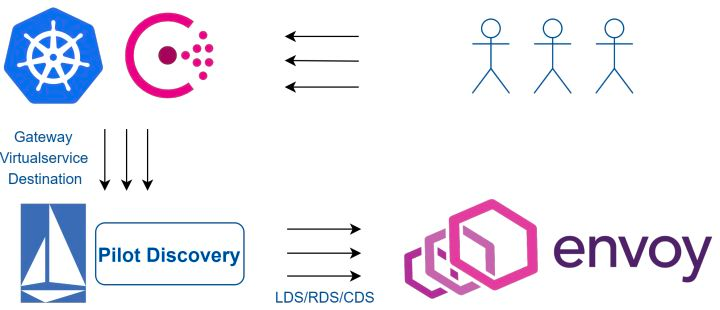
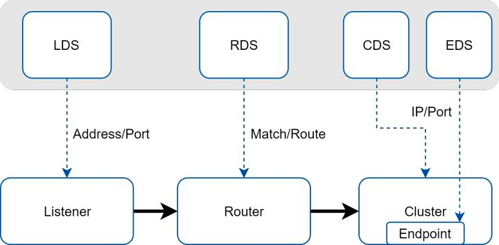

#### Envoy 介绍

1) Envoy 配置下发    

2) 资源类型   
- Listener：Envoy工作的基础
  - Listener 是 Envoy 打开的一个监听端口，用于接收来自Downstream（客户端）连接；
  - Listener 配置中核心包括监听地址、Filter链等
- Cluster：对上游服务的抽象
  - 在 Envoy 中，每个 Upstream 上游服务都被抽象成一个 Cluster
  - Cluster 包含该服务的连接池、超时时间、endpoints 地址、端口、类型等等
3) Router：上下游之间的桥梁    
- 用于桥接 Listener 和后端服务（不限定HTTP）的规则与资源集合
4) Filter：强大源于可扩展    
- 利用Filter机制，Envoy理论上可以实现任意协议的支持以及协议之间的转换，可以对请求流量进行全方位的修改和定制

3) 增量 xDS   
- Envoy 通过 xDS 协议与控制面实现配置数据的交换

xDS以及各个资源之间的关系：

